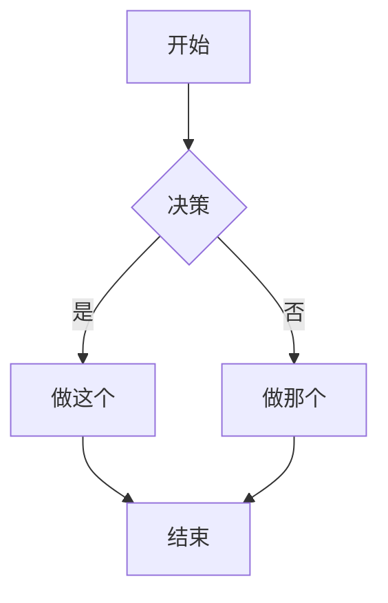
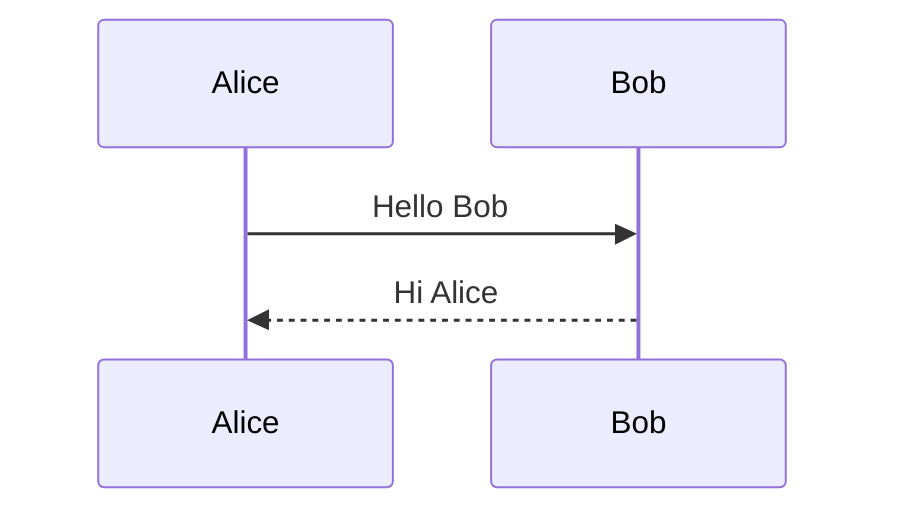
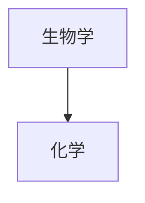
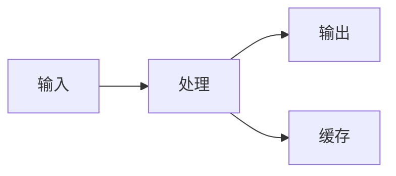

# Obsidian Flavored Markdown 技能

此技能使兼容技能的 Agent 能够创建和编辑有效的 Obsidian Flavored Markdown，包括所有 Obsidian 特定的语法扩展。

## 概览

Obsidian 使用多种 Markdown 风格的组合：

- [CommonMark](https://commonmark.org/)
- [GitHub Flavored Markdown](https://github.github.com/gfm/)
- [LaTeX](https://www.latex-project.org/) 用于数学公式
- Obsidian 特定扩展（双向链接、Callouts、嵌入等）

## 基本格式

### 段落和换行

```markdown
这是一个段落。

这是另一个段落（中间的空行创建分隔的段落）。

要在段落内换行，请在末尾添加两个空格  
或使用 Shift+Enter。
```

### 标题

```markdown
# 标题 1
## 标题 2
### 标题 3
#### 标题 4
##### 标题 5
###### 标题 6
```

### 文本格式

| 样式        | 语法                     | 示例         | 输出       |
| ----------- | ------------------------ | ------------ | ---------- |
| 粗体        | `**text**` 或 `__text__` | `**粗体**`   | **粗体**   |
| 斜体        | `*text*` 或 `_text_`     | `*斜体*`     | *斜体*     |
| 粗体 + 斜体 | `***text***`             | `***两者***` | ***两者*** |
| 删除线      | `~~text~~`               | `~~删除线~~` | ~~删除线~~ |
| 高亮        | `==text==`               | `==高亮==`   | ==高亮==   |
| 行内代码    | `` `code` ``             | `` `code` `` | `code`     |

### 转义格式

使用反斜杠转义特殊字符：

```markdown
\*这不会变成斜体\*
\#这不会变成标题
1\. 这不会变成列表项
```

常见的需要转义的字符：`\*`, `\_`, `\#`, `` \` ``, `\|`, `\~`

## 内部链接（双向链接）

### 基本链接

```markdown
[[笔记名称]]
[[笔记名称.md]]
[[笔记名称|显示文本]]
```

### 链接到标题

```markdown
[[笔记名称#标题]]
[[笔记名称#标题|自定义文本]]
[[#同一笔记中的标题]]
[[##搜索库中的所有标题]]
```

### 链接到块

```markdown
[[笔记名称#^block-id]]
[[笔记名称#^block-id|自定义文本]]
```

通过在段落末尾添加 `^block-id` 来定义块 ID：

```markdown
这是一个可以被链接的段落。 ^my-block-id
```

对于列表和引用，在单独的一行添加块 ID：

```markdown
> 这是一个引用
> 包含多行
>
^quote-id
```

### 搜索链接

```markdown
[[##heading]]     搜索包含 "heading" 的标题
[[^^block]]       搜索包含 "block" 的块
```

## Markdown 风格链接

```markdown
[显示文本](Note%20Name.md)
[显示文本](Note%20Name.md#Heading)
[显示文本](https://example.com)
[笔记](obsidian://open?vault=VaultName&file=Note.md)
```

注意：在 Markdown 链接中，空格必须进行 URL 编码为 `%20`。

## 嵌入

### 嵌入笔记

```markdown
![[笔记名称]]
![[笔记名称#标题]]
![[笔记名称#^block-id]]
```

### 嵌入图片

```markdown
![[image.png]]
![[image.png|640x480]]    宽度 x 高度
![[image.png|300]]        仅宽度（保持纵横比）
```

### 外部图片

```markdown


```

### 嵌入音频

```markdown
![[audio.mp3]]
![[audio.ogg]]
```

### 嵌入 PDF

```markdown
![[document.pdf]]
![[document.pdf#page=3]]
![[document.pdf#height=400]]
```

### 嵌入列表

```markdown
![[Note#^list-id]]
```

列表已使用块 ID 定义：

```markdown
- 项目 1
- 项目 2
- 项目 3

^list-id
```

### 嵌入搜索结果

````markdown
```query
tag:#project status:done
```
````

## Callouts

### 基本 Callout

```markdown
> [!note]
> 这是一个笔记 callout。
>
> [!info] 自定义标题
> 这个 callout 有一个自定义标题。
>
> [!tip] 仅标题
```

### 可折叠 Callouts

```markdown
> [!faq]- 默认折叠
> 内容在展开前是隐藏的。
>
> [!faq]+ 默认展开
> 内容可见，但可以折叠。
```

### 嵌套 Callouts

```markdown
> [!question] 外部 callout
> > [!note] 内部 callout
> > 嵌套内容
```

### 支持的 Callout 类型

| 类型       | 别名                   | 描述             |
| ---------- | ---------------------- | ---------------- |
| `note`     | -                      | 蓝色，铅笔图标   |
| `abstract` | `summary`, `tldr`      | 青色，剪贴板图标 |
| `info`     | -                      | 蓝色，信息图标   |
| `todo`     | -                      | 蓝色，复选框图标 |
| `tip`      | `hint`, `important`    | 青色，火焰图标   |
| `success`  | `check`, `done`        | 绿色，对勾图标   |
| `question` | `help`, `faq`          | 黄色，问号图标   |
| `warning`  | `caution`, `attention` | 橙色，警告图标   |
| `failure`  | `fail`, `missing`      | 红色，X 图标     |
| `danger`   | `error`                | 红色，闪电图标   |
| `bug`      | -                      | 红色，虫子图标   |
| `example`  | -                      | 紫色，列表图标   |
| `quote`    | `cite`                 | 灰色，引用图标   |

### 自定义 Callouts (CSS)

```css
.callout[data-callout="custom-type"] {
  --callout-color: 255, 0, 0;
  --callout-icon: lucide-alert-circle;
}
```

## 列表

### 无序列表

```markdown
- 项目 1
- 项目 2
  - 嵌套项目
  - 另一个嵌套
- 项目 3

* 也可以使用星号
+ 或者加号
```

### 有序列表

```markdown
1. 第一项
2. 第二项
   1. 嵌套编号
   2. 另一个嵌套
3. 第三项

1) 替代语法
2) 使用括号
```

### 任务列表

```markdown
- [ ] 未完成任务
- [x] 已完成任务
- [ ] 带有子任务的任务
  - [ ] 子任务 1
  - [x] 子任务 2
```

## 引用

```markdown
> 这是一个块引用。
> 它可以跨越多行。
>
> 并包含多个段落。
>
> > 嵌套引用也可以工作。
```

## 代码

### 行内代码

```markdown
使用 `反引号` 表示行内代码。
使用双反引号表示 ``包含 ` 反引号的代码``。
```

### 代码块

````markdown
```
纯文本代码块
```

```javascript
// 语法高亮代码块
function hello() {
  console.log("Hello, world!");
}
```

```python
# Python 示例
def greet(name):
    print(f"Hello, {name}!")
```
````

### 嵌套代码块

使用更多的反引号或波浪号作为外部块：

`````markdown
````markdown
这是如何创建一个代码块：
```js
console.log("Hello")
```
````
`````

## 表格

```markdown
| 标题 1   | 标题 2   | 标题 3   |
| -------- | -------- | -------- |
| 单元格 1 | 单元格 2 | 单元格 3 |
| 单元格 4 | 单元格 5 | 单元格 6 |
```

### 对齐

```markdown
| 左对齐 | 居中  | 右对齐 |
| :----- | :---: | -----: |
| 左对齐 | 居中  | 右对齐 |
```

### 在表格中使用管道符

使用反斜杠转义管道符：

```markdown
| 列 1              | 列 2            |
| ----------------- | --------------- |
| [[Link\|Display]] | ![[Image\|100]] |
```

## 数学公式 (LaTeX)

### 行内数学公式

```markdown
这是行内数学公式：$e^{i\pi} + 1 = 0$
```

### 块级数学公式

```markdown
$$
\begin{vmatrix}
a & b \\
c & d
\end{vmatrix} = ad - bc
$$
```

### 常用数学语法

```markdown
$x^2$              上标
$x_i$              下标
$\frac{a}{b}$      分数
$\sqrt{x}$         平方根
$\sum_{i=1}^{n}$   求和
$\int_a^b$         积分
$\alpha, \beta$    希腊字母
```

## 图表 (Mermaid)

````markdown

````

### 时序图

````markdown

````

### 图表中的链接

````markdown

````

## 脚注

```markdown
这句话有一个脚注[^1]。

[^1]: 这是脚注内容。

你也可以使用命名脚注[^note]。

[^note]: 命名脚注仍然显示为数字。

行内脚注也支持。^[这是行内脚注。]
```

## 注释

```markdown
这是可见的 %%但是这是隐藏的%% 文本。

%%
整个块都是隐藏的。
它不会出现在阅读视图中。
%%
```

## 水平分割线

```markdown
---
***
___
- - -
* * *
```

## 属性 (Frontmatter)

属性在笔记开头使用 YAML frontmatter：

```yaml
---
title: 我的笔记标题
date: 2024-01-15
tags:
  - project
  - important
aliases:
  - 我的笔记
  - 替代名称
cssclasses:
  - custom-class
status: in-progress
rating: 4.5
completed: false
due: 2024-02-01T14:30:00
---
```

### 属性类型

| 类型       | 示例                            |
| ---------- | ------------------------------- |
| 文本       | `title: My Title`               |
| 数字       | `rating: 4.5`                   |
| 复选框     | `completed: true`               |
| 日期       | `date: 2024-01-15`              |
| 日期和时间 | `due: 2024-01-15T14:30:00`      |
| 列表       | `tags: [one, two]` 或 YAML 列表 |
| 链接       | `related: "[[Other Note]]"`     |

### 默认属性

- `tags` - 笔记标签
- `aliases` - 笔记的替代名称
- `cssclasses` - 应用于笔记的 CSS 类

## 标签

```markdown
#tag
#nested/tag
#tag-with-dashes
#tag_with_underscores

在 frontmatter 中：
---
tags:
  - tag1
  - nested/tag2
---
```

标签可以包含：

- 字母（任何语言）
- 数字（不能作为第一个字符）
- 下划线 `_`
- 连字符 `-`
- 正斜杠 `/`（用于嵌套）

## HTML 内容

Obsidian 支持 Markdown 中的 HTML：

```markdown
<div class="custom-container">
  <span style="color: red;">彩色文本</span>
</div>

<details>
  <summary>点击展开</summary>
  这里是隐藏内容。
</details>

<kbd>Ctrl</kbd> + <kbd>C</kbd>
```

## 完整示例

````markdown
---
title: Project Alpha
date: 2024-01-15
tags:
  - project
  - active
status: in-progress
priority: high
---

# Project Alpha

## 概览

该项目旨在利用现代技术[[改进工作流程]]。

> [!important] 关键截止日期
> 第一个里程碑截止于 ==1月30日==。

## 任务

- [x] 初始规划
- [x] 资源分配
- [ ] 开发阶段
  - [ ] 后端实现
  - [ ] 前端设计
- [ ] 测试
- [ ] 部署

## 技术笔记

主要算法使用 $O(n \log n)$ 公式进行排序。

```python
def process_data(items):
    return sorted(items, key=lambda x: x.priority)
```

## 架构



## 相关文档

- ![[Meeting Notes 2024-01-10#Decisions]]
- [[Budget Allocation|预算]]
- [[Team Members]]

## 参考资料

更多详情请参阅官方文档[^1]。

[^1]: https://example.com/docs

%%
内部笔记：
- 周五与团队评审
- 考虑替代方案
%%
````

## 参考资料

- [基本格式语法](https://help.obsidian.md/syntax)
- [高级格式语法](https://help.obsidian.md/advanced-syntax)
- [Obsidian Flavored Markdown](https://help.obsidian.md/obsidian-flavored-markdown)
- [内部链接](https://help.obsidian.md/links)
- [嵌入文件](https://help.obsidian.md/embeds)
- [Callouts](https://help.obsidian.md/callouts)
- [属性](https://help.obsidian.md/properties)
